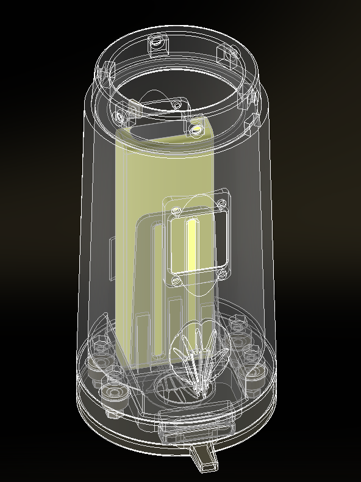

 

  

<h2 align="center">TUM Prosthesis Socket </h3>

  

     
  

Socket used as demo controller to showcase multiple prothesis prototypes at the IN-HAND:Intelligent Neuroprostheses and Human Robotics Lab.

  

The device is controlled with two antagonistic force sensor buttons, that open and close the attached prosthetic hand. We utilize an _Ottobock._ adapter to standardize the connector and power the hand with an 2000mAh LiPo battery. A self designed charging solution enables contact charging when placing the socket onto the charging plate.

  

    

